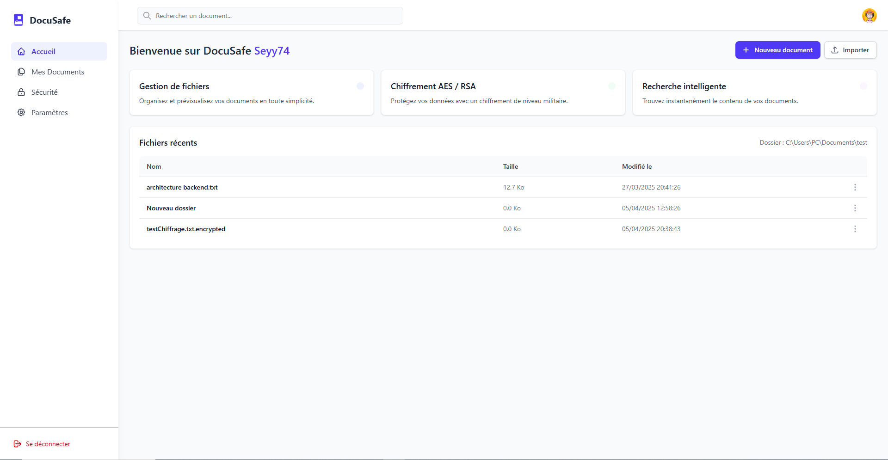

# PROJECT NOT FINISHED 

**DocumentSafe** is a secure desktop document management application designed to work offline. It enables users to store, organise, consult and search confidential documents locally, without relying on the cloud.



---

## 🛠️ Technical stack

- Frontend: **Angular (integrated into Electron)**
- Backend: **Java + Spring Boot**
- Database : **SQLite (local)**
- Packaging : **Application packaged in `.exe` for Windows (via Electron Builder) (have to do it)**

---

## ✨ Features

- 🔒 File Encryption-Decryption AES / RSA
- 🔍 Integrated search system
- 📝 Rich text editor (coming soon)
- 👤 Local multi-profile management (partially finished)
- 🔄 Real-time synchronisation between profiles via WebSocket (coming soon)
- ✅ Fluid and responsive interface

---

## 📦 Installation

### Prerequisites

- [Node.js](https://nodejs.org/)
- [Angular CLI](https://angular.io/cli)
- [Java 17+](https://adoptium.net/)
- [Maven](https://maven.apache.org/)
- [Electron](https://www.electronjs.org/)
- [SQLite](https://www.sqlite.org/index.html)

### Launch the backend (dev mode)
```bash
cd backend
mvn spring-boot:run
```

### Run frontend (dev mode)
```bash
cd frontend
npm install
npm run start
npm run electron
```

## 🧪 Tests

- Backend** : Unit tests with JUnit  
- Frontend** : Tests with Jasmine and Karma


## 🔐 Security

- Documents **never** leave the user's machine.
- Each user profile is locally isolated (coming soon).
- Local authentication possible (coming soon).
